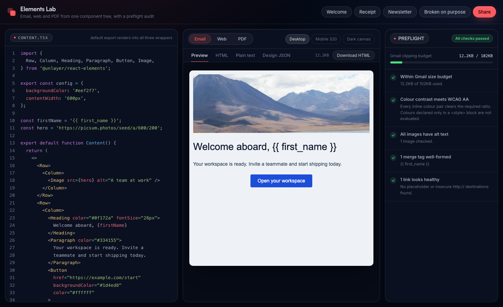
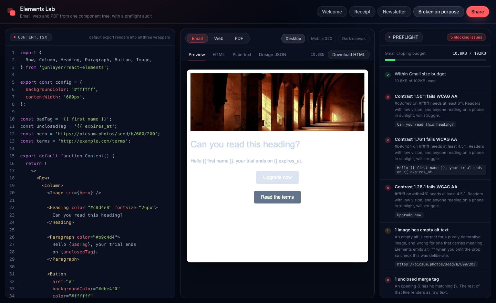

# Elements Lab

A live playground for [Unlayer Elements](https://github.com/unlayer/elements). Type JSX, see it
render as email, web and PDF at once, and get a preflight audit of the email while you type.



## The audit

This is the part no other Elements tool does. Every check runs client side on the rendered HTML.
No API key, no backend, no network calls.

| Check | Why it matters |
| --- | --- |
| **Gmail clipping budget** | Gmail truncates messages over 102KB and hides everything after the cut, including your unsubscribe link. Shown as a live meter. |
| **WCAG AA contrast** | Resolves each text element's effective foreground and background through its ancestors, then checks the ratio against 4.5:1, or 3:1 for large text. |
| **Image alt text** | Most clients block images by default, so alt text is often the only thing a reader sees. A missing `alt` is an error, an empty `alt=""` a warning, since that is correct for a decorative image but is also what Elements emits when you omit the prop. |
| **Merge tag syntax** | Errors on unclosed (`{{ expires_at`) and empty (`{{ }}`) tags, warns on a space inside a field name. Liquid filters and array access pass, because an audit that cries wolf gets ignored. |
| **Link health** | Flags placeholder `#` hrefs and insecure `http://` links, case insensitively. |

Load the **Broken on purpose** preset to see all of them fire at once:



### What it is not

Static analysis of the generated HTML, not real inbox rendering. It will not tell you how Outlook
2016 handles a specific CSS property. Litmus and Email on Acid screenshot real clients and are the
right tool for that. This catches the class of bug you can find without sending anything, two
seconds after you type it.

Two limits worth knowing: the contrast check reads inline styles and `bgcolor`, not `<style>`
blocks, and DOM based checks skip Outlook conditional comments.

## Running it

```bash
npm install
npm run dev        # http://localhost:5173
npm run build
```

Audit any rendered email from the command line:

```bash
npm run audit -- path/to/email.html
```

## Verification

```bash
npm run verify
```

58 checks. It drives the real `compile.ts` and `render.ts`, not a copy of their logic, so it fails
if the app would fail. It compiles every preset, renders each through all three wrappers, asserts
the design JSON is structurally valid, and asserts the audit reports clean templates as clean while
catching every planted defect in the broken one. The colour parser and contrast maths are unit
tested against known values: black on white must come out at exactly 21:1, the WCAG reference
figure.

## Security note

Template code is transpiled with Sucrase and evaluated via `new Function`, which is how in browser
playgrounds work. Because a share link carries executable code:

- **Code from a `#c=` link never runs on its own.** It loads into the editor for you to read, and
  the output pane shows a gate until you press Run. Code you typed yourself runs immediately.
- **The preview iframe is fully sandboxed** (`sandbox=""`), so rendered output gets an opaque origin
  and cannot reach the parent page.
- **The remaining exposure is the run itself.** Once you press Run, the template executes on the
  page's origin. A cross origin worker would close that. The gate removes the drive by, it does not
  make running a stranger's code safe.

## Stack

React 19, TypeScript, Vite, Sucrase for in browser JSX, CodeMirror 6, lz-string for URL state.
No backend.

## Licence

MIT
